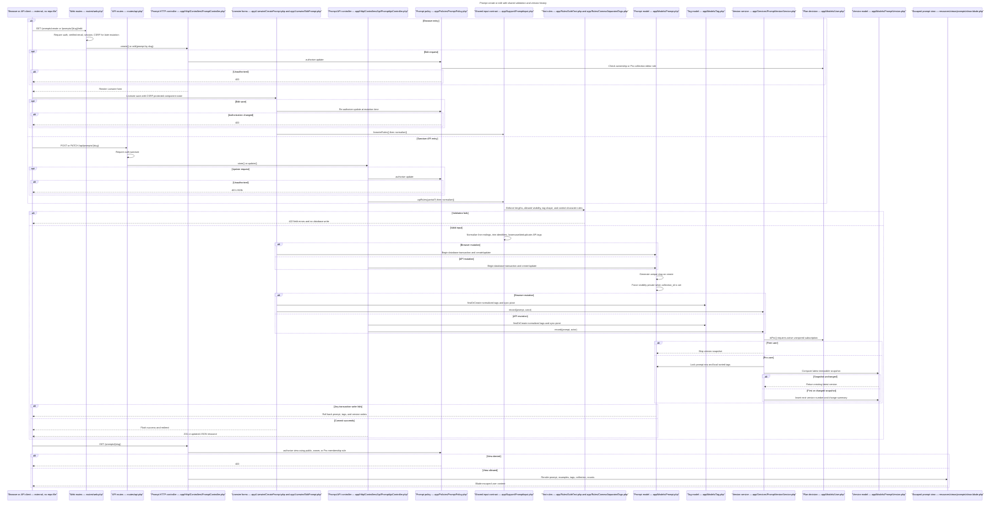
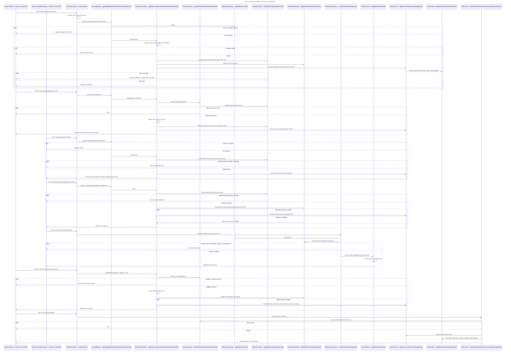

# PromptGrove architecture flows

This is a learning map of the five flows that carry most of PromptGrove's architectural decisions. The diagrams show real request order, validation, authorization, persistence, asynchronous work, and failure paths. Every internal participant includes its repository path; external actors are explicitly marked as having no repository file.

## Classification legend

- **Framework convention / boilerplate**: Laravel, Livewire, Sanctum, or package wiring used in its expected shape.
- **Custom business logic**: behavior written specifically for PromptGrove.
- **Deliberate architectural decision**: a boundary or control that was intentionally separated for security, reuse, or consistency.
- **External system**: a browser or third-party provider outside this repository.

## 1. OAuth login, account resolution, and two-factor challenge

This is the most informative authentication path because it covers provider validation, safe account linking, default-role assignment, session rotation, and the custom 2FA gate. Password login joins the same flow at `TwoFactorLoginService::login()` after `LoginRequest` verifies the password.

```mermaid
sequenceDiagram
    title OAuth login and optional two-factor challenge
    participant Browser as "Browser — external, no repo file"
    participant Pipeline as "Web pipeline — bootstrap/app.php"
    participant Headers as "Security headers — app/Http/Middleware/SecurityHeaders.php"
    participant Routes as "Auth routes — routes/auth.php"
    participant Guest as "Guest middleware — app/Http/Middleware/RedirectIfAuthenticated.php"
    participant OAuth as "OAuth controller — app/Http/Controllers/Auth/OAuthController.php"
    participant ProviderConfig as "OAuth configuration — config/services.php"
    participant Provider as "Google or GitHub — external, no repo file"
    participant Accounts as "Account resolver — app/Services/OAuthAccountService.php"
    participant OAuthModel as "OAuth identity model — app/Models/OAuthAccount.php"
    participant UserModel as "User model — app/Models/User.php"
    participant Roles as "Default-role service — app/Services/PlatformRoleService.php"
    participant WelcomeJob as "Welcome job — app/Jobs/SendWelcomeEmailJob.php"
    participant Login as "Login coordinator — app/Services/TwoFactorLoginService.php"
    participant Challenge as "2FA challenge controller — app/Http/Controllers/Auth/TwoFactorChallengeController.php"
    participant TwoFactor as "2FA verifier — app/Services/TwoFactorAuthenticationService.php"

    Browser->>Pipeline: GET /auth/google/redirect or /auth/github/redirect
    Pipeline->>Guest: Start session, require guest, append security headers
    alt Existing authenticated session
        Guest-->>Browser: 302 /dashboard
    else Guest session
        Guest->>Routes: Match allowlisted provider and throttle 20/minute
        Routes->>OAuth: redirect(provider)
        OAuth->>ProviderConfig: Require client ID, secret, callback
        alt Unsupported or unconfigured provider
            OAuth-->>Browser: 404 or login redirect with safe error
        else Configured provider
            OAuth->>Provider: Stateful Socialite authorization redirect
            Provider-->>Browser: Provider consent/login page
        end
    end
    Browser->>Pipeline: GET /auth/{provider}/callback with state and code
    Pipeline->>Routes: Restore session, apply guest middleware and throttle
    Routes->>OAuth: callback(request, provider)
    OAuth->>Provider: Exchange code and obtain provider profile
    alt Provider or Socialite failure
        OAuth-->>Browser: Login redirect with generic error
    else Provider profile received
        OAuth->>Accounts: resolve(provider, profile)
        Accounts->>OAuthModel: Lock row by provider and provider_user_id
        alt Existing linked identity
            OAuthModel-->>Accounts: Linked user
            Accounts->>OAuthModel: Refresh safe email/avatar fields
        else New provider identity
            Accounts->>Accounts: Require non-empty ID and valid email, plus Google's verified-email flag
            Accounts->>UserModel: Lock user by normalized email
            alt Missing/unverified email or conflicting provider link
                Accounts-->>OAuth: OAuthLoginException with safe message
                OAuth-->>Browser: Login redirect with safe error
            else Existing or new eligible user
                Accounts->>UserModel: Verify existing email or create verified user
                Accounts->>Roles: Assign default User platform role
                Accounts->>OAuthModel: Persist provider identity without access token
            end
        end
        Accounts-->>OAuth: Resolved User
        opt User was newly created
            OAuth-)WelcomeJob: Queue welcome email
        end
        OAuth->>Login: login(request, user)
        Login->>Login: Regenerate session ID
        alt User has confirmed 2FA
            Login->>Login: Store pending user ID and challenge timestamp only
            Login-->>Browser: 302 /two-factor-challenge
            Browser->>Pipeline: POST challenge with CSRF token
            Pipeline->>Routes: Validate session and CSRF
            Routes->>Challenge: store(request)
            Challenge->>Login: Resolve pending user within configured TTL
            alt Missing or expired pending login
                Login-->>Browser: Login redirect and clear pending state
            else Pending user valid
                Challenge->>Challenge: Validate code length and per-user/IP rate limit
                alt Challenge rate exceeded
                    Challenge-->>Browser: 422 with retry delay
                else Attempt allowed
                    Challenge->>TwoFactor: Verify TOTP or recovery code
                    TwoFactor->>UserModel: Row lock and reject replayed TOTP or consume one recovery hash
                    alt Invalid or replayed code
                        TwoFactor-->>Challenge: false
                        Challenge->>Challenge: Increment limiter
                        Challenge-->>Browser: 422 generic invalid-code error
                    else Valid code
                        TwoFactor-->>Challenge: true
                        Challenge->>Challenge: Clear limiter
                        Challenge->>Login: Clear pending state and authenticate
                        Login->>Login: Regenerate session ID again
                        Login-->>Browser: 302 intended URL or /dashboard
                    end
                end
            end
        else 2FA disabled
            Login->>Login: Authenticate user with remember preference
            Login-->>Browser: 302 intended URL or /dashboard
        end
    end
    Pipeline->>Headers: Apply response hardening and authenticated no-store policy
    Headers-->>Browser: Response with CSP and security headers
```



| Diagram Component | File Path | Responsibility | Boilerplate or Custom? |
|---|---|---|---|
| Browser | External; no repository file | Responsibility: initiates redirects, carries the Laravel session cookie, completes provider consent, and submits the CSRF-protected 2FA code. Why separate: it is an untrusted client and must never make account-linking or authentication decisions. | External system |
| Web pipeline | `bootstrap/app.php` | Responsibility: registers web/API routing, the custom guest/pro/role aliases, and global security-header middleware used by this flow. Why separate: Laravel centralizes HTTP composition at application bootstrap so controllers remain request-focused. | Framework convention with custom middleware registration |
| Security headers | `app/Http/Middleware/SecurityHeaders.php` | Responsibility: adds CSP, clickjacking/MIME/referrer/browser-policy headers, authenticated no-store caching, and production-HTTPS HSTS to every response. Why separate: response hardening is cross-cutting and must not be duplicated across auth controllers. | Custom security middleware |
| Auth routes | `routes/auth.php` | Responsibility: allowlists Google/GitHub, applies guest and rate-limit middleware, and maps OAuth and 2FA URLs to controllers. Why separate: route policy belongs at the transport boundary rather than inside domain services. | Framework convention with deliberate security constraints |
| Guest middleware | `app/Http/Middleware/RedirectIfAuthenticated.php` | Responsibility: prevents an already-authenticated session from re-entering guest-only OAuth/login/challenge routes. Why separate: the same precondition applies to multiple controllers and is reusable middleware. | Customized framework middleware |
| OAuth controller | `app/Http/Controllers/Auth/OAuthController.php` | Responsibility: checks provider support/configuration, invokes Socialite, converts provider failures into safe UI errors, dispatches new-user events, and hands the resolved user to the login coordinator. Why separate: HTTP redirects and exception presentation should not be mixed into account-linking transactions. | Custom orchestration around a framework package |
| OAuth configuration | `config/services.php` | Responsibility: maps environment-held Google/GitHub credentials and callbacks into Socialite configuration. Why separate: deploy-time secrets and provider settings must stay outside controller code. | Framework configuration convention |
| Google or GitHub | External; no repository file | Responsibility: authenticates the person and returns a provider ID, email, verification metadata, name, and avatar through Socialite. Why separate: PromptGrove delegates identity proof to the chosen OAuth provider. | External system |
| Account resolver | `app/Services/OAuthAccountService.php` | Responsibility: transactionally resolves existing identities, validates provider IDs/emails and Google's verified-email flag, safely links by email, rejects conflicts, creates users, and never persists provider access tokens. Why separate: account-linking invariants are shared business rules independent of redirect handling. | Custom business logic and deliberate security boundary |
| OAuth identity model | `app/Models/OAuthAccount.php` | Responsibility: persists the stable provider-to-user identity link and safe profile metadata. Why separate: one user can have provider identities without polluting the core user record or storing tokens. | Deliberate data-model decision |
| User model | `app/Models/User.php` | Responsibility: stores the authenticated account, encrypted 2FA fields, hashed password cast, role relations, and `twoFactorEnabled()` decision. Why separate: it is the aggregate root shared by password, OAuth, API, billing, and RBAC flows. | Framework model extended with custom domain behavior |
| Default-role service | `app/Services/PlatformRoleService.php` | Responsibility: ensures Admin/Moderator/User permissions exist and assigns the User role to a new OAuth account. Why separate: platform-role bootstrapping is reused by registration and seeders and should not be duplicated in auth controllers. | Custom business logic over Spatie RBAC |
| Welcome job | `app/Jobs/SendWelcomeEmailJob.php` | Responsibility: sends the welcome mail asynchronously for a newly created OAuth user. Why separate: mail latency and failure should be handled by the queue, not delay the OAuth callback. | Framework queue convention with custom job |
| Login coordinator | `app/Services/TwoFactorLoginService.php` | Responsibility: rotates sessions, chooses direct authentication versus a short-lived pending-2FA state, expires stale challenges, and completes login only after verification. Why separate: password and OAuth authentication must converge on exactly the same 2FA/session policy. | Custom business logic and deliberate shared boundary |
| 2FA challenge controller | `app/Http/Controllers/Auth/TwoFactorChallengeController.php` | Responsibility: validates the challenge request, enforces TTL and per-user/IP attempt limits, exposes safe errors, and completes or cancels the pending login. Why separate: HTTP validation and redirects are distinct from cryptographic verification. | Custom controller using Laravel conventions |
| 2FA verifier | `app/Services/TwoFactorAuthenticationService.php` | Responsibility: verifies only newer TOTP counters, consumes hashed recovery codes under row locks, and manages encrypted secrets. Why separate: cryptographic and replay-prevention logic needs a transactional, testable service independent of UI/controller code. | Custom security-critical business logic |
| Password login request | `app/Http/Requests/Auth/LoginRequest.php` | Responsibility: on the parallel password-login path, validates credentials, rate-limits by normalized email/IP, rehashes when needed, and returns the user to `TwoFactorLoginService`. Why separate: credential validation is a reusable form-request concern and should not be duplicated in the session controller. | Customized Laravel Breeze convention |
| Password session controller | `app/Http/Controllers/Auth/AuthenticatedSessionController.php` | Responsibility: connects `LoginRequest` to the shared 2FA login coordinator and securely invalidates sessions on logout. Why separate: it owns password-session HTTP behavior while OAuth has a different handshake. | Customized Laravel Breeze controller |
| 2FA configuration | `config/two-factor.php` | Responsibility: provides the allowed clock window, challenge TTL, and maximum attempts used in the checks above. Why separate: operational security thresholds must be configurable without editing services. | Custom configuration module |

## 2. Prompt creation/editing, validation, tags, and versioning

This flow shows the shared validation core used by Livewire and the API, policy enforcement on edits, model-level privacy enforcement for collection prompts, and Pro-only immutable versions.



| Diagram Component | File Path | Responsibility | Boilerplate or Custom? |
|---|---|---|---|
| Browser or API client | External; no repository file | Responsibility: submits prompt fields through Livewire or JSON and displays validation/authorization results. Why separate: all client data is untrusted and server controls must work independently of UI constraints. | External system |
| Web routes | `routes/web.php` | Responsibility: exposes create/edit/detail pages under authenticated and verified middleware and binds prompts by slug. Why separate: browser transport and middleware composition belong outside components and models. | Framework convention with custom route design |
| API routes | `routes/api.php` | Responsibility: exposes the Sanctum-protected Prompt API and binds API actions to the controller. Why separate: token-authenticated JSON traffic has a different middleware and response contract from browser traffic. | Framework convention with deliberate API boundary |
| Prompt HTTP controller | `app/Http/Controllers/PromptController.php` | Responsibility: renders browser pages, authorizes edit/view, and eager-loads the prompt graph required by the detail page. Why separate: page composition is HTTP work, while mutation state lives in Livewire components. | Laravel controller convention with custom authorization |
| Livewire create form | `app/Livewire/CreatePrompt.php` | Responsibility: validates component state, creates the owned prompt, synchronizes tags, and requests the first version within one transaction. Why separate: create state has no existing aggregate and different redirect/delete behavior from edit state. | Custom Livewire business component |
| Livewire edit form | `app/Livewire/EditPrompt.php` | Responsibility: authorizes on mount and again on save/delete, hydrates existing state, updates the prompt, synchronizes tags, and records changes. Why separate: editing has route-bound state and mutation-time authorization that creation does not. | Custom Livewire business component |
| Prompt API controller | `app/Http/Controllers/Api/PromptApiController.php` | Responsibility: applies the same input contract to JSON create/update, enforces prompt policies, wraps writes transactionally, and returns API resources. Why separate: API pagination, partial updates, and status codes should not leak into Livewire components. | Custom API controller using Laravel conventions |
| Prompt policy | `app/Policies/PromptPolicy.php` | Responsibility: resolves public/owner/shared-member reads, Owner/Editor writes, Pro history, analysis, deletion, and report rules. Why separate: one authorization source must protect controllers, Livewire actions, Blade `@can`, and API requests consistently. | Custom business logic and deliberate authorization boundary |
| Shared input contract | `app/Support/PromptInput.php` | Responsibility: supplies equivalent Livewire/API validation maps and canonicalizes line endings, identifiers, and tags. Why separate: it prevents the browser and API mutation paths from drifting apart. | Deliberate shared-validation architecture |
| Safe text rule | `app/Rules/SafeText.php` | Responsibility: rejects invalid control characters and newlines in single-line fields without destroying legitimate code/markup in prompt bodies. Why separate: this rule is reusable across every prompt text field and collection metadata. | Custom security validation |
| Comma-separated tag rule | `app/Rules/CommaSeparatedTags.php` | Responsibility: caps the Livewire comma-separated tag input at 10 tags and 50 characters per tag. Why separate: the browser representation differs from the API array while enforcing the same domain limits. | Custom validation adapter |
| Prompt model | `app/Models/Prompt.php` | Responsibility: defines prompt relationships, slug route binding, unique-slug generation, and the invariant that collection prompts are private. Why separate: persistence invariants must hold even when a controller, API, seeder, or future job writes the model. | Custom domain model on Eloquent |
| Tag model | `app/Models/Tag.php` | Responsibility: represents deduplicated tag names and the many-to-many prompt relation. Why separate: tags are shared entities rather than repeated prompt strings. | Framework model with domain relationships |
| Version service | `app/Services/PromptVersionService.php` | Responsibility: gates history by Pro status, locks the prompt, builds canonical snapshots, suppresses duplicates, increments versions, and produces change summaries. Why separate: immutable versioning is transactional domain behavior reused by UI, API, restore, and seeding. | Custom business logic and deliberate service boundary |
| Plan decision | `app/Models/User.php` | Responsibility: `isPro()` checks for an active subscription whose period has not expired before history is recorded or shared access is granted. Why separate: plan entitlement belongs to the user aggregate and is reused across middleware and policies. | Custom domain behavior on framework model |
| Version model | `app/Models/PromptVersion.php` | Responsibility: stores immutable prompt fields and tags as a JSON snapshot and reconstructs a comparable snapshot. Why separate: history must survive later changes to the live prompt and tag pivot. | Deliberate immutable-history model |
| Escaped prompt view | `resources/views/prompts/show.blade.php` | Responsibility: displays authorized prompt content, examples, metadata, actions, and AI component using escaped Blade output. Why separate: presentation and output encoding belong at the rendering boundary, not in storage sanitization. | Framework view convention with security-conscious custom markup |
| Prompt schema | `database/migrations/2026_09_10_000000_create_promptgrove_domain_tables.php` | Responsibility: defines prompts, tags, prompt-tag uniqueness, analysis storage, and visibility/query indexes used in this flow. Why separate: migrations version the physical database contract independently of Eloquent code. | Framework migration convention with custom schema |
| Version schema | `database/migrations/2026_09_11_000000_create_prompt_versions_table.php` | Responsibility: defines immutable version rows, creator linkage, JSON tags, and per-prompt version uniqueness. Why separate: version storage has retention and indexing needs different from live prompts. | Custom schema decision in framework migration |

## 3. Shared collection invitation, RBAC, and audited mutation

PromptGrove deliberately uses lightweight collections rather than organizations or tenant databases. The effective scope is a single `collection_id` on a prompt plus one membership row per user/collection.



| Diagram Component | File Path | Responsibility | Boilerplate or Custom? |
|---|---|---|---|
| Owner browser | External; no repository file | Responsibility: creates the collection, selects invite/member roles, receives the one-time raw invite URL, and reviews audit history. Why separate: owner intent is untrusted input until middleware, validation, and policy checks pass. | External system |
| Invitee or member browser | External; no repository file | Responsibility: presents an invite token and later attempts shared reads or writes under its own session. Why separate: possessing an invite is not itself authorization to edit or bypass Pro membership. | External system |
| Collection routes | `routes/web.php` | Responsibility: groups all collection endpoints behind `auth`, `verified`, and `pro`, and defines slug/token/member bindings. Why separate: coarse access prerequisites are transport concerns applied before controller business logic. | Framework routing convention with deliberate guard layering |
| Pro middleware | `app/Http/Middleware/RequireProSubscription.php` | Responsibility: blocks every collection route unless `User::isPro()` succeeds, returning a billing redirect for HTML or 402 for JSON. Why separate: the same entitlement gate protects collections and history without duplicating controller checks. | Custom entitlement middleware |
| Collection controller | `app/Http/Controllers/PromptCollectionController.php` | Responsibility: validates collection/invite/role/prompt commands, enforces token expiry, wraps mutations with audit writes, and handles membership lifecycle. Why separate: it coordinates HTTP commands while policies decide permission and models represent stored state. | Custom business orchestration |
| Collection policy | `app/Policies/PromptCollectionPolicy.php` | Responsibility: defines member viewing, owner-only administration/audit, and Owner/Editor prompt-add rights with Pro checks. Why separate: policy methods are reusable by controllers and Blade and cannot be replaced by hiding buttons. | Custom authorization business logic |
| Subscription lookup | `app/Models/User.php` | Responsibility: computes current Pro entitlement from active, unexpired subscription rows. Why separate: collections, history, and AI quota all consume the same user-level entitlement decision. | Custom domain behavior on framework model |
| Collection model | `app/Models/PromptCollection.php` | Responsibility: owns slug generation, hidden invite hash, expiry cast, memberships, prompts, owner, and audit-log relations. Why separate: it is the lightweight sharing aggregate without introducing an Organization tenant. | Deliberate domain-model decision |
| Membership model | `app/Models/CollectionMember.php` | Responsibility: stores exactly one Owner/Editor/Viewer role per user and collection with join time. Why separate: collection roles are resource-local and intentionally independent of platform Admin/Moderator/User roles. | Deliberate scoped-RBAC model |
| Shared prompt policy | `app/Policies/PromptPolicy.php` | Responsibility: turns collection membership into prompt-level read/edit/history/analyze decisions and immediately removes access when membership or Pro status changes. Why separate: prompt commands should ask one policy regardless of whether the prompt is personal or shared. | Custom authorization boundary |
| Prompt model | `app/Models/Prompt.php` | Responsibility: relates a prompt to at most one collection and forces any collection prompt to private visibility on every save. Why separate: privacy is a model invariant that survives alternate write paths. | Custom domain model and deliberate guardrail |
| Audit service | `app/Services/CollectionAuditLogger.php` | Responsibility: records security events, strips log-control characters, bounds metadata, excludes secrets, and coalesces repeated view events for one hour. Why separate: every mutation needs consistent, testable audit formatting without copying sensitive-data rules. | Custom security business logic |
| Audit model | `app/Models/CollectionAuditLog.php` | Responsibility: persists append-only event context and nullable relations that survive deleted users/prompts/collections. Why separate: security chronology has different retention and access requirements from ordinary collection data. | Deliberate audit data model |
| Audit viewer | `app/Http/Controllers/CollectionAuditLogController.php` | Responsibility: re-authorizes owner-only access, records that the log itself was viewed, and eager-loads/paginates display context. Why separate: viewing security records is a distinct privileged operation from managing a collection. | Custom security controller |
| Collection/RBAC schema | `database/migrations/2026_09_11_040000_create_rbac_collections_and_reports.php` | Responsibility: enforces unique membership, role indexes, hashed invite uniqueness, and the one-collection-per-prompt foreign key. Why separate: database constraints backstop application policy and encode the lightweight sharing guardrail. | Custom schema in framework migration |
| Audit schema | `database/migrations/2026_09_11_060000_create_collection_audit_logs_table.php` | Responsibility: defines event indexes and nullable foreign keys so audit chronology remains queryable after referenced objects are deleted. Why separate: audit storage was added as a security layer with its own lifecycle. | Custom security schema |

## 4. AI prompt analysis from request to queued provider result

Both Livewire and the API converge on one dispatcher. The API has an additional named route throttle; the dispatcher still owns cost limits so Livewire cannot bypass them.

```mermaid
sequenceDiagram
    title Queued AI prompt analysis with cost controls and failure states
    participant Client as "Browser or API client — external, no repo file"
    participant Routes as "Analysis API route — routes/api.php"
    participant LimiterConfig as "Named limiter — app/Providers/AppServiceProvider.php"
    participant Livewire as "Analysis UI — app/Livewire/AnalyzePrompt.php"
    participant ApiController as "Analysis API controller — app/Http/Controllers/Api/PromptAnalysisApiController.php"
    participant Policy as "Prompt policy — app/Policies/PromptPolicy.php"
    participant Dispatcher as "Analysis dispatcher — app/Services/PromptAnalysisDispatcher.php"
    participant AnalysisConfig as "Analysis configuration — config/prompt-analysis.php"
    participant ProviderConfig as "OpenRouter credentials — config/services.php"
    participant UserModel as "Plan quota lookup — app/Models/User.php"
    participant PromptModel as "Prompt source — app/Models/Prompt.php"
    participant AnalysisModel as "Analysis state — app/Models/PromptAnalysis.php"
    participant QueueJob as "Analysis job — app/Jobs/AnalyzePromptJob.php"
    participant Analyzer as "OpenRouter adapter — app/Services/OpenRouterPromptAnalyzer.php"
    participant OpenRouter as "OpenRouter API — external, no repo file"
    participant ResultView as "Polling result view — resources/views/livewire/analyze-prompt.blade.php"

    alt Browser action
        Client->>Livewire: wire:click analyze with CSRF-protected session
        Livewire->>Policy: authorize analyze on prompt
        alt Not owner or eligible collection editor
            Policy-->>Client: 403
        else Authorized
            Livewire->>Dispatcher: dispatch(prompt, authenticated user)
        end
    else API action
        Client->>Routes: POST /api/prompts/{slug}/analyses with bearer token
        Routes->>Routes: Require auth:sanctum
        Routes->>LimiterConfig: Apply prompt-analysis-api per-user minute limit
        alt API route limit exceeded
            LimiterConfig-->>Client: 429 with rate-limit headers
        else API request admitted
            Routes->>ApiController: store(request, prompt)
            ApiController->>Policy: authorize analyze
            alt Unauthorized
                Policy-->>Client: 403 JSON
            else Authorized
                ApiController->>Dispatcher: dispatch(prompt, authenticated user)
            end
        end
    end
    Dispatcher->>Analyzer: configured()
    Analyzer->>AnalysisConfig: Read provider model, quotas, burst, and timeout
    Analyzer->>ProviderConfig: Read server-side OpenRouter key and base URL
    alt Provider not configured
        Dispatcher-->>Client: 503 safe configuration message, no row created
    else Configured
        Dispatcher->>PromptModel: Begin transaction and lock prompt row
        Dispatcher->>AnalysisModel: Check pending or processing analysis for prompt
        alt Active analysis exists
            Dispatcher-->>Client: 409 duplicate-in-progress error
        else No active analysis
            Dispatcher->>UserModel: isPro() selects 5/hour or 25/hour quota
            Dispatcher->>AnalysisConfig: Read 3/minute burst threshold
            alt Burst threshold exceeded
                Dispatcher-->>Client: 429 with retry seconds
            else Burst allowed
                Dispatcher->>Dispatcher: Atomically attempt hourly limiter
                alt Hourly quota exhausted
                    Dispatcher-->>Client: 429 with retry minutes
                else Quota available
                    Dispatcher->>AnalysisModel: Insert pending row with exact prompt/model snapshot
                    Dispatcher->>Dispatcher: Increment burst limiter and commit
                    Dispatcher-)QueueJob: Dispatch analysis job asynchronously
                    alt Queue dispatch fails
                        Dispatcher->>AnalysisModel: Mark failed with generic queue error
                        Dispatcher-->>Client: 503 safe retry message
                    else Queued
                        Dispatcher-->>Client: Pending state or API 202
                    end
                end
            end
        end
    end
    QueueJob->>AnalysisModel: Set processing and clear previous failure
    QueueJob->>Analyzer: analyze(snapshot text, snapshot target model)
    Analyzer->>Analyzer: Treat submitted prompt as data and construct strict JSON schema request
    Analyzer->>OpenRouter: POST /chat/completions with timeout and two HTTP retries
    alt Connection, HTTP, or provider failure
        OpenRouter-->>Analyzer: Failure
        Analyzer-->>QueueJob: PromptAnalysisException with safe message
        QueueJob->>AnalysisModel: Mark failed and bound failure reason
        alt Queue attempts remain
            QueueJob-)QueueJob: Retry with 10s then 30s backoff, max 3 tries
        else All attempts exhausted
            QueueJob->>AnalysisModel: Store generic final failure
        end
    else Provider response received
        OpenRouter-->>Analyzer: Candidate JSON, provider model, token usage
        Analyzer->>Analyzer: Strip optional fence, decode JSON, validate exact fields and length limits
        alt Empty, malformed, or incomplete output
            Analyzer-->>QueueJob: PromptAnalysisException
            QueueJob->>AnalysisModel: Mark failed and enter retry policy
        else Valid structured analysis
            Analyzer-->>QueueJob: Intent, weaknesses, improved prompt, token counts
            QueueJob->>AnalysisModel: Mark completed and persist result/completed_at
        end
    end
    Client->>ResultView: Poll every 3 seconds while active
    ResultView->>AnalysisModel: Load latest five analyses for current user
    ResultView-->>Client: Escaped status, errors, before/after text, and token usage
```



| Diagram Component | File Path | Responsibility | Boilerplate or Custom? |
|---|---|---|---|
| Browser or API client | External; no repository file | Responsibility: requests analysis and polls/reads the resulting state. Why separate: it never receives the OpenRouter key and cannot decide authorization or quota. | External system |
| Analysis API route | `routes/api.php` | Responsibility: requires Sanctum and applies the named AI-specific throttle before invoking the API controller. Why separate: HTTP abuse rejection should happen before domain work or queue writes. | Framework routing with deliberate cost-control middleware |
| Named limiter | `app/Providers/AppServiceProvider.php` | Responsibility: defines the per-user `prompt-analysis-api` minute bucket used by route middleware. Why separate: Laravel named limiters are centrally registered and can be reused or tuned without controller changes. | Framework convention with custom limit policy |
| Analysis UI | `app/Livewire/AnalyzePrompt.php` | Responsibility: authorizes at mount and action time, translates domain exceptions into field errors, scopes history to the current user, and exposes remaining hourly quota. Why separate: reactive UI/polling concerns do not belong in the dispatcher or job. | Custom Livewire component |
| Analysis API controller | `app/Http/Controllers/Api/PromptAnalysisApiController.php` | Responsibility: authorizes create/read, validates analysis-to-prompt ownership, maps domain exceptions to JSON status codes, and returns resources. Why separate: JSON pagination/status behavior differs from Livewire presentation. | Custom API controller |
| Prompt policy | `app/Policies/PromptPolicy.php` | Responsibility: permits analysis only to the prompt owner or a Pro Owner/Editor in its collection. Why separate: the same rule protects UI visibility, Livewire mutation, and API calls. | Custom authorization business logic |
| Analysis dispatcher | `app/Services/PromptAnalysisDispatcher.php` | Responsibility: verifies configuration, locks against duplicates, enforces plan/hour and burst limits, snapshots source data, creates pending state, and safely dispatches the job. Why separate: both UI and API need identical cost and concurrency guarantees. | Custom business logic and deliberate orchestration boundary |
| Analysis configuration | `config/prompt-analysis.php` | Responsibility: supplies provider/model, Free/Pro hourly quotas, burst threshold, and provider timeout. Why separate: operational cost controls must be environment-tunable. | Custom configuration module |
| OpenRouter credentials | `config/services.php` | Responsibility: maps the environment-held API key and base URL used by the analyzer. Why separate: secrets and deploy-time provider endpoints must remain outside service code. | Framework service-configuration convention |
| Plan quota lookup | `app/Models/User.php` | Responsibility: determines whether the dispatcher uses the Free or Pro hourly limit. Why separate: entitlement is reused beyond AI analysis. | Custom domain behavior on framework model |
| Prompt source | `app/Models/Prompt.php` | Responsibility: provides the locked source text, target model, authorization relations, and analysis relation. Why separate: the live prompt remains its own aggregate while each analysis retains a historical snapshot. | Custom domain model |
| Analysis state | `app/Models/PromptAnalysis.php` | Responsibility: persists pending/processing/completed/failed states, source snapshot, structured result, failure reason, provider model, and token counts. Why separate: asynchronous state must outlive the request and must not overwrite the prompt. | Deliberate async-state model |
| Analysis job | `app/Jobs/AnalyzePromptJob.php` | Responsibility: transitions status, invokes the provider adapter, retries three times with backoff, records bounded failures, and finalizes completed output. Why separate: external AI latency and retries should run in a queue worker, not the HTTP request. | Framework queue convention with custom state machine |
| OpenRouter adapter | `app/Services/OpenRouterPromptAnalyzer.php` | Responsibility: builds the injection-resistant analysis prompt, requests strict JSON-schema output, applies timeout/retry behavior, validates provider output, and returns normalized fields. Why separate: provider protocol and parsing can change without altering queue or UI orchestration. | Custom external-service adapter |
| OpenRouter API | External; no repository file | Responsibility: performs the model inference and returns candidate structured content and usage. Why separate: it is an untrusted third-party response that PromptGrove validates before persistence. | External system |
| Polling result view | `resources/views/livewire/analyze-prompt.blade.php` | Responsibility: polls only during active states and renders escaped intent, weakness, source, improved prompt, error, and token data. Why separate: reactive presentation is independent from provider and state-transition logic. | Custom Blade/Livewire presentation |
| Analysis exception | `app/Exceptions/PromptAnalysisException.php` | Responsibility: carries a safe user-facing message and intended HTTP status across dispatcher/adapter/controller boundaries. Why separate: expected domain failures need controlled presentation distinct from unexpected stack traces. | Custom error contract |
| Analysis schema extension | `database/migrations/2026_09_11_010000_add_source_context_to_prompt_analyses_table.php` | Responsibility: adds immutable source text/model and completion time required by queued before/after results. Why separate: it versions an analysis-storage change without rewriting the original domain migration. | Framework migration convention with deliberate snapshot design |

## 5. Test-mode subscription checkout, verified callback, and idempotent webhook

Stripe is the deployed demo provider: it uses hosted Checkout, binds each session to the signed-in user, re-fetches both Checkout and subscription state, and treats signed webhooks as the authoritative asynchronous path. Razorpay and PayPal remain complete, disabled provider adapters with mocked coverage; they are not provider-validated because sandbox signup is unavailable from Pakistan. Webhooks are outside browser CSRF by design and use provider signatures instead.

```mermaid
sequenceDiagram
    title Test-mode billing checkout and webhook reconciliation
    participant Browser as "Browser — external, no repo file"
    participant WebRoutes as "Billing web routes — routes/web.php"
    participant ApiRoutes as "Webhook API routes — routes/api.php"
    participant Billing as "Billing controller — app/Http/Controllers/BillingController.php"
    participant StripeGateway as "Stripe adapter — app/Services/StripeSubscriptionGateway.php"
    participant RazorpayGateway as "Razorpay adapter — app/Services/RazorpaySubscriptionGateway.php"
    participant PayPalGateway as "PayPal adapter — app/Services/PayPalSubscriptionGateway.php"
    participant Provider as "Stripe, Razorpay, or PayPal test provider — external, no repo file"
    participant SubscriptionService as "Subscription service — app/Services/SubscriptionService.php"
    participant SubscriptionModel as "Subscription model — app/Models/Subscription.php"
    participant CheckoutView as "Razorpay checkout view — resources/views/billing/razorpay-checkout.blade.php"
    participant Webhook as "Webhook controller — app/Http/Controllers/BillingWebhookController.php"
    participant EventModel as "Webhook event model — app/Models/PaymentWebhookEvent.php"
    participant ProGate as "Pro middleware — app/Http/Middleware/RequireProSubscription.php"

    Browser->>WebRoutes: POST /billing/stripe, /billing/razorpay, or /billing/paypal with CSRF
    WebRoutes->>WebRoutes: Require authenticated verified session and valid CSRF token
    WebRoutes->>Billing: stripe(), razorpay(), or paypal()
    Billing->>SubscriptionModel: Check user is not already Pro
    alt Already active and unexpired
        Billing-->>Browser: Redirect with already-active message
    else Upgrade allowed
        alt Stripe selected (deployed demo)
            Billing->>StripeGateway: createCheckout(user)
            StripeGateway->>StripeGateway: Require enabled sk_test key and recurring price ID
            alt Disabled, missing, or live configuration
                StripeGateway-->>Billing: BillingException
                Billing-->>Browser: Safe test-mode configuration error
            else Test configuration valid
                StripeGateway->>Provider: Create hosted subscription Checkout with user/price metadata and idempotency key
                alt Provider failure or invalid Checkout URL
                    Provider-->>StripeGateway: SDK exception, timeout, or invalid URL
                    StripeGateway-->>Billing: Safe BillingException or provider exception
                    Billing-->>Browser: Safe checkout failure
                else Checkout session created
                    Provider-->>StripeGateway: cs_test session and checkout.stripe.com URL
                    StripeGateway-->>Billing: Normalized session ID and URL
                    Billing-->>Browser: Redirect to hosted Stripe Checkout
                    Browser->>Provider: Complete or cancel test checkout
                    alt User cancels
                        Provider-->>Browser: Return to /billing?cancelled=1 with no entitlement change
                    else Checkout completes
                        Provider-->>WebRoutes: GET /billing/stripe/return?session_id=cs_test...
                        WebRoutes->>Billing: stripeReturn(request)
                        Billing->>Billing: Validate session_id shape
                        Billing->>StripeGateway: fetchCheckout(session_id) with expanded subscription
                        StripeGateway->>Provider: Retrieve Checkout Session server-to-server
                        alt Fetch fails or session is incomplete/wrong mode/wrong user
                            Provider-->>StripeGateway: Error or mismatched state
                            Billing-->>Browser: Safe verification failure, no Pro access
                        else Session belongs to signed-in user
                            StripeGateway-->>Billing: Complete subscription session and subscription ID
                            Billing->>StripeGateway: fetchSubscription(subscription_id)
                            StripeGateway->>Provider: Retrieve authoritative current subscription
                            alt Subscription fetch fails
                                Provider-->>StripeGateway: Error or timeout
                                Billing-->>Browser: Safe confirmation failure
                            else Current subscription returned
                                StripeGateway-->>Billing: Normalized ID, price, status, period, and user metadata
                                Billing->>SubscriptionService: createLocal(user, stripe, remote)
                                SubscriptionService->>SubscriptionService: Require exact configured price and prevent cross-user binding
                                SubscriptionService->>SubscriptionModel: Upsert verified subscription and allowlisted metadata
                                Billing-->>Browser: Redirect with active or pending result
                            end
                        end
                    end
                end
            end
        else Razorpay selected (disabled in deployed demo)
            Billing->>RazorpayGateway: create(user)
            RazorpayGateway->>RazorpayGateway: Require rzp_test key, secret, and valid plan ID
            alt Missing or live/malformed configuration
                RazorpayGateway-->>Billing: BillingException
                Billing-->>Browser: Safe sandbox configuration error
            else Test configuration valid
                RazorpayGateway->>Provider: POST /subscriptions with configured plan
                alt Provider HTTP failure
                    Provider-->>RazorpayGateway: Error or timeout
                    RazorpayGateway-->>Billing: HTTP exception
                    Billing-->>Browser: Safe failure message
                else Remote subscription returned
                    Provider-->>RazorpayGateway: Remote subscription
                    RazorpayGateway-->>Billing: Remote data
                    Billing->>SubscriptionService: createLocal(user, razorpay, remote)
                    SubscriptionService->>SubscriptionService: Require IDs, exact configured plan, and no cross-user collision
                    alt Invalid provider identity or plan
                        SubscriptionService-->>Billing: BillingException and no entitlement
                        Billing-->>Browser: Safe failure message
                    else Verified remote identity
                        SubscriptionService->>SubscriptionModel: Upsert pending local subscription and safe metadata
                        Billing->>CheckoutView: Render hosted test-checkout launcher
                        CheckoutView->>Provider: Open Razorpay hosted checkout
                        alt User cancels or hosted checkout fails
                            Provider-->>CheckoutView: No confirmation payload, local row remains pending
                        else Hosted checkout returns values
                            Provider-->>CheckoutView: payment_id, subscription_id, signature
                            CheckoutView->>WebRoutes: POST /billing/razorpay/confirm with CSRF
                            WebRoutes->>Billing: confirmRazorpay(request)
                            Billing->>Billing: Validate ID lengths and 64-character signature
                            Billing->>SubscriptionModel: Find subscription belonging to current user and provider
                            alt Not owned or unknown subscription
                                SubscriptionModel-->>Browser: 404
                            else Local subscription found
                                Billing->>RazorpayGateway: verifyCheckout HMAC
                                alt HMAC mismatch
                                    RazorpayGateway-->>Browser: 422, no Pro access
                                else Signature valid
                                    Billing->>RazorpayGateway: fetch subscription server-to-server
                                    RazorpayGateway->>Provider: GET /subscriptions/{id}
                                    alt Fetch fails
                                        Provider-->>RazorpayGateway: Error or timeout
                                        RazorpayGateway-->>Billing: HTTP exception
                                        Billing-->>Browser: Safe confirmation failure
                                    else Authoritative state returned
                                        Provider-->>RazorpayGateway: Authoritative status and plan
                                        RazorpayGateway-->>Billing: Remote subscription
                                        Billing->>SubscriptionService: sync(local, remote)
                                    end
                                end
                            end
                        end
                    end
                end
            end
        else PayPal selected (disabled in deployed demo)
            Billing->>PayPalGateway: create(user)
            PayPalGateway->>PayPalGateway: Require sandbox credentials and plan
            PayPalGateway->>Provider: OAuth client credentials token request
            alt OAuth or provider request fails
                Provider-->>PayPalGateway: Error, missing token, or timeout
                PayPalGateway-->>Billing: BillingException or HTTP exception
                Billing-->>Browser: Safe sandbox failure
            else OAuth token issued
                Provider-->>PayPalGateway: Access token
                PayPalGateway->>Provider: POST /v1/billing/subscriptions with return URLs
                alt Subscription create fails
                    Provider-->>PayPalGateway: Error or timeout
                    PayPalGateway-->>Billing: HTTP exception
                    Billing-->>Browser: Safe sandbox failure
                else Remote subscription returned
                    Provider-->>PayPalGateway: Remote subscription and links
                    PayPalGateway-->>Billing: Remote data
                    Billing->>SubscriptionService: Verify plan/identity and create local pending row
                    alt Identity or configured plan validation fails
                        SubscriptionService-->>Billing: BillingException and no local row
                        Billing-->>Browser: Safe sandbox failure
                    else Local pending row created
                        SubscriptionService->>SubscriptionModel: Persist pending subscription and safe metadata
                        Billing->>Billing: Store pending provider ID in session
                        Billing->>PayPalGateway: approvalUrl(remote)
                        PayPalGateway->>PayPalGateway: Require approval URL host sandbox.paypal.com
                        alt Approval link absent or host invalid
                            PayPalGateway-->>Billing: BillingException, local row remains pending
                            Billing-->>Browser: Safe sandbox failure
                        else Valid sandbox approval
                            Billing-->>Browser: Redirect to PayPal sandbox approval
                            Browser->>Provider: Approve subscription
                            Provider-->>WebRoutes: GET /billing/paypal/return?subscription_id=...
                            WebRoutes->>Billing: paypalReturn(request)
                            Billing->>Billing: Pull pending session ID and reject missing identifier
                            Billing->>SubscriptionModel: Find PayPal subscription belonging to current user
                            alt Missing or cross-account ID
                                SubscriptionModel-->>Browser: 404 or 422
                            else Owned pending subscription
                                Billing->>PayPalGateway: fetch subscription server-to-server
                                PayPalGateway->>Provider: OAuth then GET /v1/billing/subscriptions/{id}
                                alt Fetch or OAuth fails
                                    Provider-->>PayPalGateway: Error, missing token, or timeout
                                    PayPalGateway-->>Billing: HTTP exception
                                    Billing-->>Browser: Safe confirmation failure
                                else Authoritative state returned
                                    Provider-->>PayPalGateway: Authoritative status and plan
                                    PayPalGateway-->>Billing: Remote subscription
                                    Billing->>SubscriptionService: sync(local, remote)
                                end
                            end
                        end
                    end
                end
            end
        end
        opt Browser callback reached SubscriptionService sync
            SubscriptionService->>SubscriptionService: Verify remote ID and plan match local identity
            alt Identity mismatch or provider error
                SubscriptionService-->>Billing: BillingException
                Billing-->>Browser: Safe error and no entitlement change
            else Identity verified
                SubscriptionService->>SubscriptionModel: Normalize status/period and keep allowlisted metadata
                SubscriptionModel-->>Billing: Active only if status active and period end is future
                Billing-->>Browser: Redirect with active or pending result
            end
        end
    end

    Provider->>ApiRoutes: POST /api/webhooks/stripe, /razorpay, or /paypal
    ApiRoutes->>Webhook: Route through API stack without cookie CSRF
    alt Stripe webhook
        Webhook->>StripeGateway: Verify Stripe-Signature over timestamp plus raw body
    else Razorpay webhook
        Webhook->>RazorpayGateway: Verify X-Razorpay-Signature HMAC over raw body
    else PayPal webhook
        Webhook->>PayPalGateway: Send transmission headers and event to verification API
        PayPalGateway->>Provider: POST /v1/notifications/verify-webhook-signature
        Provider-->>PayPalGateway: SUCCESS or failure
    end
    alt Signature verification returns invalid
        Webhook-->>Provider: 401, no event processing
    else Provider verification request throws
        Webhook-->>Provider: Unhandled 5xx, no event row, provider may retry
    else Authentic webhook
        Webhook->>EventModel: firstOrCreate unique provider plus event ID with payload
        alt Previously processed event
            EventModel-->>Webhook: Existing processed row
            Webhook-->>Provider: 200 received, no duplicate mutation
        else New or retryable event
            alt Stripe lifecycle event with subscription ID
                Webhook->>StripeGateway: fetchSubscription(subscription_id)
                StripeGateway->>Provider: Retrieve current authoritative subscription state
                Webhook->>SubscriptionModel: Find Stripe subscription or resolve user from signed metadata
                Webhook->>SubscriptionService: Sync existing or create verified local subscription
            else Razorpay or PayPal lifecycle payload
                Webhook->>SubscriptionModel: Find local subscription by provider and remote ID
                opt Known local subscription payload
                    Webhook->>SubscriptionService: sync(local, remote payload)
                end
            end
            opt Subscription state is available
                SubscriptionService->>SubscriptionService: Recheck exact subscription ID and plan
                SubscriptionService->>SubscriptionModel: Normalize status, dates, cancellation, safe metadata
            end
            alt Processing throws
                Webhook->>EventModel: Mark failed with generic reason
                Webhook-->>Provider: 500 so provider can retry
            else Processing succeeds or event is irrelevant
                Webhook->>EventModel: Mark processed and timestamp
                Webhook-->>Provider: 200 received
            end
        end
    end
    Browser->>ProGate: Request version history or collections
    ProGate->>SubscriptionModel: Require active status and future period end
    alt Entitlement inactive
        ProGate-->>Browser: Billing redirect or JSON 402
    else Entitlement active
        ProGate-->>Browser: Continue to Pro feature
    end
```

| Diagram Component | File Path | Responsibility | Boilerplate or Custom? |
|---|---|---|---|
| Browser | External; no repository file | Responsibility: starts a test checkout, follows hosted-provider redirects, and returns provider identifiers/signatures through CSRF-protected browser routes. Why separate: browser-returned billing data is untrusted until cryptographic and server-to-server checks pass. | External system |
| Billing web routes | `routes/web.php` | Responsibility: exposes checkout, confirmation, return, and cancellation under authenticated/verified web middleware and CSRF. Why separate: browser billing actions use session identity and HTML redirects. | Framework routing convention with custom billing endpoints |
| Webhook API routes | `routes/api.php` | Responsibility: exposes provider callbacks outside cookie-CSRF middleware. Why separate: providers cannot submit a browser CSRF token, so authenticity is established by provider signatures instead. | Deliberate security boundary using framework routing |
| Billing controller | `app/Http/Controllers/BillingController.php` | Responsibility: prevents duplicate upgrades, validates callbacks, binds provider IDs to the signed-in user's local subscription, re-fetches provider state, cancels subscriptions, and returns safe errors. Why separate: browser/session orchestration should not contain provider protocol or status-normalization logic. | Custom business orchestration |
| Stripe adapter | `app/Services/StripeSubscriptionGateway.php` | Responsibility: enforces test credentials, creates idempotent hosted Checkout sessions, allowlists the redirect host, re-fetches Checkout/subscription state, verifies Stripe webhook signatures, normalizes current billing periods, and cancels subscriptions. Why separate: Stripe SDK objects, Checkout identity rules, and signature semantics are provider-specific. | Custom external-service adapter using the official Stripe SDK and a deliberate test-only guard |
| Razorpay adapter | `app/Services/RazorpaySubscriptionGateway.php` | Responsibility: enforces test-key/plan format, calls subscription APIs, verifies checkout HMAC, verifies raw-body webhook HMAC, and applies HTTP timeouts. Why separate: Razorpay authentication and signature rules are provider-specific. | Custom external-service adapter and deliberate sandbox guard |
| PayPal adapter | `app/Services/PayPalSubscriptionGateway.php` | Responsibility: obtains sandbox OAuth tokens, creates/fetches/cancels subscriptions, allowlists approval hosts, and verifies webhook signatures through PayPal. Why separate: PayPal's protocol differs materially from Razorpay and can evolve independently. | Custom external-service adapter and deliberate sandbox guard |
| Stripe, Razorpay, or PayPal test provider | External; no repository file | Responsibility: hosts checkout, owns authoritative subscription status, and signs/sends webhook events. Why separate: PromptGrove does not collect card data or trust browser claims about payment state. | External systems |
| Subscription service | `app/Services/SubscriptionService.php` | Responsibility: verifies provider/plan identity, prevents cross-user binding, maps provider statuses/periods, and persists only allowlisted metadata. Why separate: both gateways and webhook/browser paths must use one entitlement-normalization contract. | Custom business logic and deliberate anti-confusion boundary |
| Subscription model | `app/Models/Subscription.php` | Responsibility: stores the local provider record and grants Pro only for active status with a future period end. Why separate: provider synchronization history is separate from the user record and can support multiple attempts/providers. | Custom domain model |
| Razorpay checkout view | `resources/views/billing/razorpay-checkout.blade.php` | Responsibility: launches hosted Razorpay test checkout and posts returned IDs/signature into the CSRF-protected confirmation route. Why separate: provider JavaScript belongs at the presentation edge, while verification stays server-side. | Custom presentation integration |
| Webhook controller | `app/Http/Controllers/BillingWebhookController.php` | Responsibility: verifies before parsing/mutating, deduplicates events, conditionally syncs known subscriptions, records processed/failed state, and returns retryable 500 errors. Why separate: webhook identity and retry semantics differ from signed-in browser callbacks. | Custom security-critical controller |
| Webhook event model | `app/Models/PaymentWebhookEvent.php` | Responsibility: stores provider event IDs, payloads, processing state, generic failures, and timestamps for idempotency/audit. Why separate: provider delivery attempts need their own unique lifecycle apart from subscriptions. | Deliberate idempotency model |
| Pro middleware | `app/Http/Middleware/RequireProSubscription.php` | Responsibility: turns the synchronized subscription record into route access, with distinct HTML and JSON denial responses. Why separate: feature controllers should not each reimplement plan gating. | Custom entitlement middleware |
| Billing exception | `app/Exceptions/BillingException.php` | Responsibility: carries expected safe billing failures and statuses without exposing raw provider exceptions to users. Why separate: operational/provider errors need controlled presentation distinct from programming failures. | Custom error contract |
| Billing configuration | `config/billing.php` | Responsibility: fixes the portfolio plan at USD 9/month, enables Stripe for the hosted demo, disables Razorpay/PayPal there, and maps provider credentials/IDs. Why separate: deploy-time provider settings and the test-only guard must not be hardcoded across services. | Custom configuration and deliberate test-mode decision |
| Billing schema | `database/migrations/2026_09_11_050000_create_billing_tables.php` | Responsibility: enforces unique provider subscription IDs and unique provider/event IDs while indexing webhook processing state. Why separate: database constraints provide the final defense against duplicate links and deliveries. | Custom schema in framework migration |

## Cross-flow architectural takeaways

1. **Transport layers converge on services.** Livewire and JSON controllers remain separate, but validation, authorization, versioning, analysis dispatch, and subscription reconciliation converge on shared classes.
2. **Coarse and fine authorization are layered.** Route middleware checks authentication, verification, Pro entitlement, and throttles; policies still authorize the exact prompt or collection at mutation time.
3. **External claims are never final state.** OAuth profiles are verified and transactionally linked, AI output is schema-validated, and billing browser/webhook data is signature-checked and identity-matched.
4. **Long-running work becomes persisted state plus a job.** Welcome email and AI analysis use queue jobs; AI status is queryable even after the initiating request finishes.
5. **Database constraints reinforce application decisions.** Unique OAuth identities, one collection membership, one prompt collection, sequential versions, provider subscription IDs, and webhook event IDs are schema-level safeguards.

## Recommended reading order

1. `routes/web.php`, `routes/api.php`, and `routes/auth.php` to see every entry point and coarse middleware boundary.
2. `app/Policies/PromptPolicy.php` and `app/Policies/PromptCollectionPolicy.php` to understand who can do what.
3. `app/Livewire/CreatePrompt.php`, `app/Livewire/EditPrompt.php`, and `app/Support/PromptInput.php` for the core prompt write path.
4. `app/Services/PromptAnalysisDispatcher.php`, `app/Jobs/AnalyzePromptJob.php`, and `app/Services/OpenRouterPromptAnalyzer.php` for asynchronous orchestration.
5. `app/Http/Controllers/PromptCollectionController.php` and `app/Services/CollectionAuditLogger.php` for scoped collaboration.
6. `app/Http/Controllers/BillingWebhookController.php` and `app/Services/SubscriptionService.php` for idempotent external-event handling.
